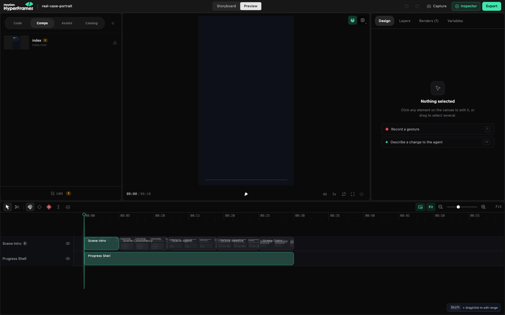

[English](2026-09-14-agent-editing-ranking-by-phase.md) · **Français**

# Montage piloté par agent : le classement, phase par phase

*Note de terrain, 14 septembre 2026, mise à jour le matin même avec deux tests de plus. Compagnon de [Monter avec des agents, par type de travail](2026-09-13-editing-with-agents-by-type-of-work.fr.md). Ce texte-là explique la position. Celui-ci, ce sont les tableaux : quel outil pour quelle phase, quelle machine, quel canal, et ce qui est mort. Écrit pour quelqu'un qui ne vit pas dans une salle de montage. Tout ce qui est marqué « mesuré » a tourné sur mes propres machines entre le 13 et le 14 septembre ; le reste est lu dans les documentations et les dépôts le même jour.*

## En trois phrases

Personne n'a un seul outil qui fait un film de bout en bout avec un agent, et ce n'est pas près d'arriver. Ce qui existe, c'est une chaîne de formats et d'API autour de deux hôtes fermés que la plupart des monteurs ont déjà : Final Cut pour couper à la main, Resolve Studio pour tout ce que l'agent fait seul. Le mot qui trie tout est **headless** : est-ce que l'outil rend, coupe ou exporte sans fenêtre ouverte. Les surfaces « agent-first » de 2026 (Palmier, Velorn, Frontstage, NodeTool, basketikun) ont toutes moins de six mois ; on en teste deux ou trois une heure chacune, on n'y met jamais le master.

Lexique : **socle** = on peut s'y appuyer aujourd'hui · **labo** = intéressant, vaut une heure, jamais la source de vérité · **à oublier** = mort, licence piège, ou pas de vrai canal agent · **headless** = tourne sans écran, lançable par un agent ou un cron sur une tour GPU.

## 0. Phase par phase : ce que tu fais, où, et ce que fait l'agent

| Phase | Ce que tu fais | Où tu es | Ce que fait l'agent, par quel canal | Headless | Mon choix, en quelques mots |
|---|---|---|---|---|---|
| 1a. Collecter des références | Chiner, relier, annoter | Are.na (API ouverte) ; Freeform sur iPad pour le mur du canapé ; Kosmik écarté (pas d'API) | Range, relie, retrouve (API Are.na) | oui | Are.na, l'API vit |
| 1b. Penser une scène sur un mur, comparer des mondes | Poser, comparer, jeter, garder ; générer à côté de la source | Un board maison au-dessus d'un magasin de plans comme vérité ; basketikun infinite-canvas (MIT, MCP, canvas.best est sa version hébergée) comme labo ; Martini pour le mur plus timeline plus set 3D, fermé | Pose des médias, génère des variantes reliées à leur source (ComfyUI sur les tours) ; le MCP de basketikun vérifié sur son propre store | non, c'est pour l'œil ; le serveur, oui | le board : prises nommées, ComfyUI ; 1a et 1b sur la même surface dès qu'il importe Are.na |
| 1c. Câbler une recette qui se répète | Une fois le look verrouillé : même personnage, vingt plans | OpenChar Studio (ex Inline, GPL, prises versionnées, ComfyUI en back) ; Flora et Krea Nodes, fermés ; NodeTool (AGPL, MCP officiel) en atelier | Relance la recette, ne recalcule que l'aval, garde chaque prise | oui | OpenChar : prises versionnées, GPL ; jamais un deuxième outil à graphes pour fuir ComfyUI |
| 1d. Continuité de personnages et de décors | Décider ce qui ne change jamais | Bible visuelle sur le board ; Raccord (MIT, MCP) et OpenChar pour mesurer la dérive ; LoRA sur les tours | Mesure la dérive, tient la bible, relance | oui | la bible sur le board, Raccord mesure |
| 2. Écriture, découpage | Écrire, découper, décider | Texte : Obsidian, Notion ; une courbe narrative maison | Transcrit, structure, propose la courbe, tient le journal | oui | Obsidian seul pour écrire ; Notion en miroir vers l'équipe, dans un sens |
| 3. Boards et animatique | Juger le rythme avant de payer une génération | Blender VSE plus Grease Pencil, ou Resolve ; Storyboarder pour l'ergonomie seulement | Aligne les boards sur le son temporaire, rend l'animatique (`bpy`, MCP Resolve) | oui (Blender en arrière-plan) | Resolve quand les boards sont des images (l'animatique devient le montage) ; Blender quand le trait ou la caméra comptent (tous les angles existent déjà) |
| 4. Tournage réel | Filmer ce qui doit être incarné | Blackmagic 6K, iPhone ProRes log | Ingestion, LUT, transcription, registre de plans (Kitsu avec une équipe) | oui | ffmpeg, un indexeur, Parakeet |
| 5. Génération d'images et de plans | Choisir la prise qui reste | Le board (prises versionnées) au-dessus de ComfyUI sur les tours ; Krita AI pour l'image fixe ; Pallaidium à tester | Génère, versionne, écrit le sidecar et le C2PA (API ComfyUI, MCP) | oui | ComfyUI sur les tours par le board ; Pallaidium en mode distant dans Blender (mesuré, Mac compris) ; des fronts simples au-dessus de ComfyUI, jamais un autre graphe |
| 6. Compositing et VFX | Le regard sur le détail, plan par plan | Resolve Fusion (Studio) ; compositeur Blender pour la 3D ; Natron en labo | Pose une version au timecode, désactive l'ancienne (MCP natif, vérifié) | app ouverte | Fusion, le plan reste dans la timeline ; Blender pour ses propres passes ; Natron quand il sera stable ; After Effects seulement si livré |
| 7a. Montage du film, documentaire et narratif | Couper le sens, avec un monteur Final Cut | Final Cut Pro | Prépare : sélections, ours, marqueurs, en fichiers FCPXML | préparation oui, coupe non | Final Cut : ma coupe, mon monteur |
| 7b. Montage d'extraits et de réseaux | Relire, donner le go | Palmier piloté par un agent de code (mesuré), ou ffmpeg plus un exécuteur de recettes sans interface | Coupe, sous-titre, recadre, exporte en FCPXML vers Final Cut ou Resolve (MCP Palmier, 51 outils) | Palmier : app ouverte ; ffmpeg : oui | Palmier, moins d'une seconde par coupe, puis Final Cut sans dialogue |
| 7c. Montage hybride, VFX | Arbitrer les plans générés | Resolve Studio, Mac et Windows | Tout ce qu'il fait seul sur une timeline (MCP natif) | app ouverte | Resolve, l'hôte de l'agent |
| 8. Son | Écouter, mixer, ou le mixeur | REAPER (scriptable) ; Fairlight dans Resolve | Transcrit (Parakeet), nettoie, normalise, fondus (MCP Resolve vérifié) | partiel | REAPER pour le mix, Fairlight pour ce qui vit dans la timeline, ffmpeg et auto-editor en headless ; un classement complet du son suit |
| 9. Couleur et conformation | Étalonner, ou l'étalonneur | Resolve Studio ; OpenColorIO ; pont OTIO et FCPXML | Importe la structure, exporte, relie les médias (vérifié sur le FCPXML de Palmier) | export oui | Resolve plus OTIO, structure seulement |
| 10. Livraison | Donner le go | Compressor ; DCP-o-matic | Encode, décline, sous-titre (ffmpeg, HandBrake, whisper) | oui | ffmpeg, Compressor, DCP-o-matic |
| 11. Démos, motion, habillage | Relire, décider du graphisme | Remotion, HyperFrames pour le web ; Apple Motion dans un film | Écrit et rend (mesuré) | oui pour le web | Remotion pour les composants, HyperFrames et son Studio local pour une page, Motion par clonage de templates |

Deux règles traversent la table : entre 7a et 7c le partage se fait par séquence, jamais par plan ; et le canal agent n'existe que sur les machines de bureau, l'iPad sert à relire.

## 1. Par situation : qu'est-ce que j'ouvre, qui fait quoi

| Situation | Outil à ouvrir | Ce que fait l'agent | Ce que tu fais | Headless |
|---|---|---|---|---|
| Un extrait de 60 s pour Instagram, TikTok, YouTube | Rien : un exécuteur de recettes ou ffmpeg plus Parakeet, puis relecture | Coupe, sous-titre, recadre en trois formats, exporte | Tu relis et tu donnes le go de publication | oui |
| Un premier assemblage d'une interview de deux heures | Final Cut (ou Palmier en test) | Transcrit, propose des sélections et un ours en FCPXML | Tu coupes le sens dans Final Cut | préparation oui, coupe non |
| Générer un plan et le poser dans le film | ComfyUI sur une tour, puis Resolve Studio | Génère, pose la version au timecode, désactive l'ancienne, écrit le sidecar | Tu choisis la prise qui reste | génération oui, pose oui si Resolve est ouvert |
| Un mur de références pour une scène | Un board maison, basketikun infinite-canvas en labo | Pose des médias, génère des variantes à côté | Tu compares, tu jettes, tu gardes | non, une surface pour l'œil |
| Un animatique avant de payer une génération | Blender VSE (boards plus son temporaire) ou Resolve | Aligne les boards sur le son, rend l'animatique | Tu juges le rythme | oui (Blender en arrière-plan) |
| Une démo de mon outil ou une vidéo de dépôt GitHub | Remotion ou HyperFrames | Écrit le script, le faux terminal, rend en 16:9 et 9:16 | Tu relis | oui |
| Générique, titres, habillage | Apple Motion dans un film ; HyperFrames ou Remotion pour le web | Produit des séquences autonomes que tu réimportes | Tu décides du graphisme | oui pour le web, non pour Motion |
| Conformer, étalonner, livrer un DCP | Resolve Studio, OpenTimelineIO pour l'échange, DCP-o-matic | Importe la structure, exporte les déclinaisons | Tu étalonnes, ou l'étalonneur | export oui, étalonnage non |

## 2. Par phase : le classement

Trois critères par outil, notés **oui / partiel / non** : *marche aujourd'hui* (mûr, maintenu) · *un agent le pilote* (API vivante, MCP, CLI ou projet lisible) · *sort vers Final Cut ou Resolve*. Plus la colonne headless.

### Idéation, références, mur

| Rang | Outil | Marche | Agent | Sort vers FCP/Resolve | Headless | Verdict |
|---|---|---|---|---|---|---|
| 1 | Un board maison au-dessus d'un magasin de plans (ComfyUI en back) | partiel | oui | via le magasin | non | socle chez moi |
| 2 | basketikun/infinite-canvas (MIT, 6 470 étoiles, v0.18 du 7 sept.) | oui | oui, MCP pour agents de code | non, médias plus JSON | non | labo prioritaire |
| 3 | NodeTool (AGPL, 523 étoiles, MCP officiel, surfaces film) | oui | oui | non, MP4 | serveur oui | labo : un atelier boards et génération, pas un mur |
| 4 | BeatDesign (Apache, 27 étoiles, 29 outils MCP, 3 sept.) | jeune | oui | non | non | labo |
| 5 | Excalidraw, AFFiNE (murs humains, MCP) | oui | lecture surtout | non | non | mur sans vidéo |
| à oublier | Jaaz (licence non OSI, calme depuis mars), hero8152 (arrêté le 28 août), Boardfish (source visible, pas d'API), Vibe Workflow, OpenFlow, Loomic (cloud) | | | | | |

### Boards, découpage, animatique

| Rang | Outil | Marche | Agent | Sort vers FCP/Resolve | Headless | Verdict |
|---|---|---|---|---|---|---|
| 1 | Blender 5.2 VSE plus Grease Pencil | oui | oui, `bpy`, 95 % de l'app | rendu vidéo, OTIO par add-on | oui | socle animatique |
| 2 | Resolve (timeline de boards plus son) | oui | oui, MCP natif | c'est Resolve | app ouverte | socle |
| 3 | Kitsu (registre de plans, REST) | oui | oui | métadonnées | oui | labo utile avec une équipe |
| 4 | OpenFrame (AGPL, 115 étoiles, FCPXML) | jeune | partiel | oui | ? | labo |
| à oublier | Storyboarder (mort depuis 2022), Storyboard Tool (sans licence) | | | | | |

### Génération d'images et de plans

| Rang | Outil | Marche | Agent | Sort vers FCP/Resolve | Headless | Verdict |
|---|---|---|---|---|---|---|
| 1 | ComfyUI 0.35 plus le MCP officiel (local et cloud) sur les tours | oui | oui | fichiers | oui | socle |
| 2 | Pallaidium dans Blender VSE (GPL, 1,5 k étoiles, maj juillet) | oui, Windows surtout | oui, `bpy` plus wrappers MCP | strips VSE | oui | socle d'un studio 3D plus IA dans un VSE ; installé sur une tour, à tester |
| 3 | Krita AI Diffusion (image fixe) | oui | partiel | fichiers | non | socle image |
| 4 | OpenChar Studio (ex Inline, GPL, moteur local, LTX-2.5, FLUX.2) | actif | graphe JSON, pas de MCP | fichiers | partiel | labo, plan par plan |
| 5 | Raccord (MIT, MCP local, continuité de film) | jeune | oui | OTIO/EDL annoncés | ? | labo |
| 6 | ComfyUI-SecondUnit (1 étoile, pose les médias dans Resolve) | trop jeune | | oui | | veille |
| à oublier | artokun/comfyui-mcp (archivé le 10 sept.), le plugin Resolve de Higgsfield (crédits cloud, pas de canal agent dans le plugin) | | | | | |

### Compositing et VFX

| Rang | Outil | Marche | Agent | Headless | Verdict |
|---|---|---|---|---|---|
| 1 | Fusion dans Resolve Studio | oui | oui, Python et Lua, MCP natif | app ouverte | socle production (fermé) |
| 2 | Compositeur Blender | oui | oui, `bpy` | oui | socle pour les plans 3D |
| 3 | Natron 2.5.1 préversion | fragile | Python plus MCP bêta | oui (NatronRenderer) | labo |

### Montage

| Rang | Outil | Marche | Agent | Sort vers FCP/Resolve | Headless | Verdict |
|---|---|---|---|---|---|---|
| 1 | Resolve Studio 21.1 (MCP natif, mesuré) | oui | oui | c'est l'hôte | app ouverte | socle de tout ce que l'agent fait seul |
| 2 | Final Cut Pro 12.3 | oui | fichiers FCPXML, plus SpliceKit (compilé depuis les sources avec les deux pull requests ouvertes, vivant sur 12.3 : 222 outils MCP, 213 méthodes RPC, lectures en 1 à 6 ms) comme couche d'analyse et de finition dans une bibliothèque déjà ouverte : transcription locale Parakeet avec diarisation, montage par le texte, silences, captions, export FCPXML direct, OTIO, BRAW. Pas de création de projet par paramètres, pas de pose avec bornes source : ça passe par les dialogues de Final Cut | c'est l'hôte | non | socle de la coupe à la main ; pour construire un montage par agent, la voie reste Palmier plus import FCPXML ; SpliceKit sert une fois la bibliothèque ouverte, et casse à chaque mise à jour d'Apple |
| 3 | MLT / melt plus ffmpeg | oui | oui, XML plus CLI | via OTIO | oui | socle headless pour les extraits |
| 4 | Palmier (14 385 étoiles, MCP 51 outils, écrit du FCPXML 1.10, fermé depuis le 28 août, macOS 26) | oui, **mesuré** : 3 rushes, 8 coupes, un titre, un changement de piste, export, réimport dans Resolve à l'image exacte, médias reliés seuls | oui, le meilleur adressage vu (`clipId`, images) | oui, vérifié dans Resolve ; import Final Cut sans dialogue | app ouverte | **socle des extraits pilotés par agent**, jamais le master |
| 5 | Velorn (GPL, 475 étoiles, 100+ outils MCP, FCPXML, v0.3.33 du 10 sept.) | 0.3 | oui | annoncé, non validé | ? | labo ; MCP en écoute 4 s après lancement (mesuré), test inachevé |
| 6 | Shotcut plus shotcut-mcp (GPL, MLT) | oui | MCP tiers actif | via MLT/OTIO | melt oui | labo |
| 7 | Kdenlive (GPL, XML MLT, adaptateur OTIO officiel) | oui | forks MCP seulement | OTIO | non | vivant, pas obsolète, pas de canal vivant |
| 8 | Frontstage (GPL, port de Palmier, MCP 51 outils, FCPXML) | 10 étoiles, une semaine | oui | annoncé | web | un fork né il y a une semaine, quoi qu'en dise un moteur de recherche. À surveiller |
| 9 | Diffusion Studio (MPL, alpha, « la timeline est du code ») | alpha | skills plus CLI | non | oui | un moteur à lire, pas une timeline |
| 10 | Timeline Studio (MIT, PWA, MCP en extension) | v1.0.8 | oui | non | non | labo web |
| 11 | OpenShot 4.0 (30 août), FableCut, WeftCut, Kaestral | jeunes ou sans MCP mûr | | | | veille |
| à oublier | Olive (alpha chronique), Flowblade (pas d'agent), OpenCut (réécriture, MCP promis) | | | | | |

### Son

Pas de socle unique ouvert. Pièces : Ardour 9.8 (MCP expérimental, OSC), REAPER (fermé, ReaScript, 60 $), whisper.cpp et Parakeet pour la transcription, Fairlight dans Resolve par le MCP natif (volume, fondus, normalisation vérifiés). Tout headless sauf REAPER et Fairlight.

### Couleur, conformation, livraison

| Rang | Outil | Marche | Agent | Headless | Verdict |
|---|---|---|---|---|---|
| 1 | OpenTimelineIO 0.18.1 (Apache) | oui | oui, `.otio` lisible | oui | socle d'échange ; l'adaptateur FCPXML est sorti du bundle en mars 2026 et, testé, réécrit du 1.10 en 1.8 avec des chemins de médias inventés : structure seulement, le FCPXML doit être écrit par quelque chose de maintenu |
| 2 | OpenColorIO 2.5 | oui | CLI, Python | oui | socle couleur |
| 3 | Resolve Studio (étalonnage, conformation) | oui | oui | app ouverte | socle |
| 4 | DCP-o-matic 2.18 (CLI) | oui | oui | oui | socle DCP |
| 5 | ffmpeg 9, HandBrakeCLI, whisper.cpp | oui | oui | oui | socle livraison |

## 2 bis. Sur quelle machine : Mac, Windows, Linux, iPad, headless

Colonnes : macOS (Apple Silicon) · Windows (tours NVIDIA) · Linux · iPad · headless (rend ou coupe sans écran). Source : une matrice de plateformes à 86 URL lue le 13 septembre, version courante entre parenthèses.

| Outil | macOS | Windows | Linux | iPad | Headless | Vitesse mesurée ou documentée |
|---|---|---|---|---|---|---|
| Final Cut Pro (12.3) | oui, macOS 15.6+ | non | non | app distincte, pas paritaire | non | lancement 20 s ; import FCPXML sans dialogue |
| Motion (6.3), Compressor (5.3) | oui | non | non | non | Compressor oui (CLI), Motion non | |
| Resolve Studio (21.1) plus MCP natif | oui, macOS 15+ | oui, GPU 4 Go | oui, Rocky 8.6 | oui, sans scripting | partiel, app requise | lancement 2 min ; le MCP relance son Python après 5 min d'inactivité |
| Palmier (0.9.0) | macOS 26 seulement, Apple Silicon | non | non | non | non, app requise | moins d'1 s par opération, 3 XML en 2 s, 30 s de H.264 exportées en 20 s (mesuré) |
| Velorn (0.3.33) | oui | oui | oui | non | non documenté | MCP en écoute 4 s après lancement (mesuré) |
| Frontstage, Kaestral (forks de Palmier) | web / non | natifs | web | non | partiel | inconnu |
| Diffusion Studio, Timeline Studio, OpenCut | web ou app Mac | web | web | non | partiel (CLI) | |
| Kdenlive (26.08), Shotcut (26.8) | oui | oui | oui | non | oui via melt | |
| Flowblade | non | non | oui | non | partiel | |
| Blender (5.2) VSE et compositeur | oui | oui | oui | non | oui, `-b` | |
| Pallaidium | non supporté | oui, CUDA requis | limité | non | non documenté | |
| ComfyUI (0.35) | oui | oui, CUDA | oui | navigateur | oui, API | |
| Krita plus AI Diffusion | oui, macOS 14+ | oui | oui | non | partiel (ComfyUI headless) | |
| NodeTool (0.7) | oui, macOS 12+ | oui | oui, AppImage | non | oui, CLI et Docker | |
| basketikun infinite-canvas (0.18) | navigateur | navigateur | Docker | navigateur | serveur oui | instantané, rendu dans le navigateur |
| OpenChar Studio | oui | oui | oui, NVIDIA conseillée | non | oui, serveur | |
| Natron (2.5) | Intel sous Rosetta, Apple Silicon en alpha | oui | oui | non | oui, NatronRenderer | |
| HyperFrames, Remotion, Motion Canvas | oui (Node plus Chrome) | oui | oui | non | oui, CLI | HyperFrames 30 s en 16:9 rendues en local (mesuré) |
| Un exécuteur de recettes (OpenMontage) | oui | oui | oui | non | oui | |
| REAPER (7.80), Ardour | oui | oui | oui | non | partiel | |
| OpenTimelineIO (0.18.1), OpenColorIO (2.5.2), DCP-o-matic (2.18.50) | oui | oui | oui | non | oui, CLI | |
| CapCut, Descript | oui | oui | web | CapCut bêta | non | |
| After Effects (26.5), Premiere (26.5) | oui | oui | non | non | AE oui (`aerender`), Premiere non | |

Ce qui en sort : le bloc Mac natif (Final Cut, Motion, Compressor, Palmier) ne tourne que sur le portable ; tout ce qu'un agent lance sur une tour Windows ou sur un Mac serveur sans écran doit être dans la liste headless (ComfyUI, Blender, ffmpeg, melt, OTIO, Remotion, HyperFrames, l'exécuteur de recettes) ou dans Resolve, seul NLE qui vit sur les trois systèmes avec une API.

## 2 ter. Machines et réseau

Sur les tours GPU la même nuit : Krita 5.3.3 plus AI Diffusion 1.53.0, les nœuds Deforum pour ComfyUI, et sur l'une d'elles Blender 5.2 LTS avec Pallaidium activé (54 plugins chargés, préférences sauvées). Deux choses qu'un agent ne peut pas faire par ssh sur Windows : redémarrer un service qu'il n'a pas lancé, et installer quoi que ce soit pendant qu'un `winget upgrade` planifié tient Windows Installer, ce que l'un a fait pendant vingt heures. Ces étapes restent manuelles, devant la machine.

Côté réseau, avec Tailscale 1.102 : Serve donne à chaque tour un nom HTTPS stable pour ComfyUI sans ouvrir son port à Internet ; les grants remplacent les ACL ; Tailnet Lock vaut la peine avec deux signataires. Funnel pour ComfyUI, les sorties Mullvad, les subnet routers, Headscale (client 1.80 minimum, sans parité) et un DERP privé n'apportent rien ici. Pour 50 Go de rushes, mesurer un chemin direct contre un chemin relayé avant de changer d'outil : rsync sur ssh ou SMB sur l'IP Tailscale, Taildrop pour le ponctuel.

## 2 quater. Apple Motion piloté par un agent

Motion 6.3 n'a ni API, ni CLI, ni rendu sans écran. Mais ses templates pour Final Cut (`.moti`, `.motr`, `.moef`, `.motg`) sont du XML lisible (OZML) dans `~/Movies/Motion Templates.localized/`. La voie robuste : valider des templates maîtres dans Motion avec des paramètres publiés, puis laisser l'agent les cloner et en changer les valeurs (textes, couleurs, durées) pour produire des variantes. Il ne synthétise jamais un `.moti` de zéro. Un prototype communautaire côté fichiers existe. Pour les génériques, les lots et les habillages multi-format, Remotion et HyperFrames en ProRes 4444 avec alpha restent plus sûrs ; After Effects garde `aerender` en réserve. Une inconnue : Apple ne garantit pas que Final Cut 12.3 rafraîchisse immédiatement les templates déposés.

## 3. Face à face : les éditeurs « agent-first »

| | Palmier | Frontstage | Velorn | Diffusion Studio | Timeline Studio |
|---|---|---|---|---|---|
| Modèle | pistes ordonnées, non magnétique, calques par ordre de piste | même modèle (port de Palmier) | timeline classique | calques, groupes, scènes, arbre en code | pistes simples (visuels, overlays, captions) |
| L'agent adresse | `clipId`, `trackId`, images entières | idem | outils MCP | le code lui-même | plan JSON, diff et apply |
| Canal | MCP local, 51 outils | agent 40 outils plus MCP 51 | 100+ outils MCP | skills plus CLI, pas de MCP documenté | skill plus CLI plus MCP |
| Sort vers FCP/Resolve | FCPXML 1.10 à 1.14, XMEML | annoncé | annoncé, non validé | non | non |
| Ouvert | fermé depuis la 0.8.1 | GPL-3 | GPL-3 | MPL-2 | MIT |
| Plateforme | macOS 26 seulement | web, Windows | Mac, Windows, Linux | web, Electron | PWA |
| Âge, taille | 2 mois, 14 385 étoiles | 1 semaine, 10 étoiles | 475 étoiles, 0.3 | alpha, 2,7 k étoiles | 808 étoiles |
| Pour moi | l'outil des extraits, mesuré | surveiller | tester (inachevé) | lire le code | ignorer |

Le test d'une heure qui tranche un éditeur : trois rushes courts avec timecode, demander à un agent de code un montage de 60 à 90 s, six coupes, un changement de piste, un titre ; exporter deux FCPXML (cible Final Cut, cible Resolve) ; réussite seulement si aucune coupe ne dérive d'une image, aucun média ne se relie à la main et les clips restent éditables. Palmier l'a passé.

## 3 bis. Les canevas testés en vrai (onze outils, 35 captures)

Même protocole pour chacun : installation, lancement, trois images et une vidéo posées, session MCP ouverte et outils comptés, une génération ComfyUI sur une tour locale, export, capture.

| Outil | Vidéo lue sur le canevas | MCP (outils) | ComfyUI local | Export | Verdict |
|---|---|---|---|---|---|
| basketikun/infinite-canvas 0.18 | oui, ProRes et H.264 | 34 | non (endpoints OpenAI ou Gemini seulement) | zip JSON plus fichiers, pas de timeline | meilleur canevas et meilleur MCP de canevas ; zéro montage, zéro ComfyUI natif |
| BeatDesign 0.2.3 | oui H.264, ProRes refusé au-delà de 100 Mo | 29, avec révision attendue et reçus | non (sa propre API seulement) | MP4 rendu serveur, pas de FCPXML | meilleure timeline agentique ; fournisseur unique |
| NodeTool 0.7 | non (images par plan) | 11 | possible par nœud, non exécuté | zip de stills plus storyboard | storyboard, puis stills, puis clips ; pas de canevas libre ; prend le premier plan au lancement |
| Jaaz 1.0.30 | non | 0 (API HTTP) | oui natif, mais piloté par un LLM de chat absent | JSON Excalidraw | en sommeil depuis mars 2026 |
| Excalidraw plus MCP | non (pas de vidéo) | 26 | sans objet | .excalidraw | tableau blanc pour agent ; `describe_scene` à copier |
| AFFiNE | non | 105 | sans objet | Markdown, PDF | trop lourd, sans vidéo |
| OpenChar 1.3.21 (ex Inline) | non vérifié | 0 (REST) | non (moteur torch intégré) | zip, prises par `/v1/takes` | la prise comme objet, à reprendre |
| Raccord 1.4.0 | non vérifiable | 145 | non (kie.ai seulement) | refusé sans clip généré | grammaire de direction la plus riche ; rien sans clé |
| DX-OS | client fermé | annoncé | annoncé | inconnu | successeur propriétaire de hero8152, hors périmètre |
| **Un board maison au-dessus d'un magasin de plans** | posée oui, **lue non dans Chromium** (proxy HEVC 10 bits) | 7 | **oui, la seule génération locale réussie** (Flux img2img sur une tour, 15 s, prise posée et reliée) après écriture du workflow : les quatre livrés étaient des placeholders | FCP7 XML plus JSON du board | la seule chaîne locale complète, deux trous bloquants |
| Martini | oui (documentation) | 36 hébergés | non | XML plus zip | la référence du set 3D, rien d'installable |

**Verdict sur le board maison : améliorer, pas abandonner.** Aucun outil testé ne réunit une prise nommée, ComfyUI en back, une sortie vers un éditeur, des médias lourds et l'exécution locale. Dans l'ordre : proxies en H.264 8 bits (sinon la vidéo est noire dans Chromium), un workflow ComfyUI réel par moteur (Flux écrit cette nuit-là, restent Wan, LTX et VACE), le MCP dans le dépôt avec les verbes empruntés, OTIO et FCPXML 1.x. Si les deux premiers points ne sont pas faits vite, la comparaison bascule vers basketikun (canevas) plus un adaptateur vers ComfyUI plus BeatDesign (timeline), au prix de deux projets étrangers et d'aucune notion de prise.

Les gestes à emprunter, vus en vrai : état du board et opérations par lot avec sélection (basketikun) ; révision attendue, identifiant de commande et reçu sur toute écriture, diagnostics du mur, prise suivante depuis la dernière image (BeatDesign) ; description textuelle de la scène, checkpoints et diff du board (Excalidraw, Raccord) ; aperçu du payload ComfyUI avant envoi, et un lint (Raccord) ; vocabulaire de plan et « assembler » seulement quand chaque scène a une prise (NodeTool, Raccord) ; proxy ComfyUI et dépôt de workflows JSON comme moteurs (Jaaz) ; vue d'ensemble en un appel, upload en deux temps, pile de variantes (Martini).

**Krea.** J'ai relu une de mes sessions Krea Agent de bout en bout et je quitte la plateforme : le prix, et une modération sur des images qui ne posent aucun problème. Ce qu'elle fait bien se reproduit à la maison : un modèle de raisonnement comme cerveau, la boucle « génère, regarde, corrige », plusieurs modèles dans un même geste, une mesure (un script de grain) quand il faut mesurer. Le stack cible : un agent de code comme cerveau, le board local comme surface, ComfyUI sur les tours d'abord, une API payante seulement pour les modèles sans équivalent local et seulement sur un go explicite, tous les modèles ouverts (Ollama, OpenRouter) branchables au board.

## 4. Morts ou vivants

Règle de lecture, corrigée après un rapport détaillé aux sources datées : un dépôt sans commit n'est pas mort s'il tourne encore et si personne n'a refait son geste. « Mort » ne s'applique qu'à ce qui est archivé, cassé sans fork, ou remplacé par le même geste ailleurs.

| Outil | État au 14 septembre 2026 | Remplacé par |
|---|---|---|
| Storyboarder (Wonder Unit) | mort, derniers commits juin 2022 | Blender VSE plus Grease Pencil, Resolve |
| hero8152 Infinite-Canvas | arrêté le 28 août 2026 | basketikun |
| artokun/comfyui-mcp | archivé le 10 septembre 2026 | le MCP ComfyUI officiel |
| Comfy-Org/comfy-cloud-mcp, Comfy-Org/desktop | archivés (juin, mai 2026) | MCP officiel, Comfy-Desktop |
| Olive | alpha chronique | rien à faire |
| Jaaz | licence non OSI, dépôt calme depuis mars 2026 | basketikun, un board local |
| OpenCut | en réécriture, MCP non livré | attendre |
| Code source de Palmier | GPL jusqu'à 0.7.6, fermé ensuite | Frontstage ou Kaestral si les forks tiennent |
| SpliceKit | vivant sur Final Cut 12.3 une fois les deux pull requests ouvertes appliquées et le patch lancé à la main ; mainteneur silencieux depuis mai | rien encore ; le FCPXML par fichier reste la voie de base |
| otio-fcpx-xml-adapter | dernier commit juin 2024, sorti du bundle, réécrit le 1.10 en 1.8 avec des chemins inventés | n'importe quel écrivain FCPXML maintenu |
| Kdenlive, Shotcut, OpenShot | vivants, versions 2026 | rien, mais pas de canal vivant sauf shotcut-mcp |
| deforum/sd-webui-deforum | **stable et gelé** sur A1111 1.9 (mai 2024), vivant artistiquement : aucun modèle vidéo 2026 ne refait la boucle img2img récursive avec reprojection 3D et paramètres image par image | garder un environnement A1111 1.9 figé sur une tour ; qualifier le port officiel `deforum/deforum-comfy-nodes` (mai 2026) ; Parseq comme séquenceur ; le fork Forge reste expérimental. Wan Camera, Uni3C et VACE contrôlent une caméra, pas cette boucle |
| ProPainter | stable sans commit, pile ancienne | reste la référence du retrait vidéo ; comparer ComfyUI_ProPainter_Nodes et DiffuEraser sur une 5090 avant de changer |
| FizzNodes | stable, partiellement cassé sur la pile 2026 | **pas de remplaçant** : KJNodes ne fait pas `BatchPromptSchedule` ; garder pour les anciens graphes |
| AdvancedLivePortrait | cassé sur ComfyUI récent | le fork `sheepbooy` pour la sculpture manuelle d'expressions ; LivePortrait officiel, OmniHuman, X-Portrait seulement pour le pilotage par vidéo ou audio |
| FFCreator | stable sans commit | garder pour les scripts existants ; HyperFrames ou Remotion pour le neuf |
| Steerable-Motion (banodoco) | vivant lentement, voie Wan/VACE ajoutée | archiver les graphes AnimateDiff ; LTX multi-guides, Wan first/last, FramePack pour le neuf |
| OTIO-AVFoundation, Text_to_Video_Markers, reuelk/pipeline | finis, pas abandonnés | garder pour leur cas ; fcp-mcp-server (DareDev256) ou fcp-mcp (dreliq9) pour écrire du FCPXML 1.13 |

## 4 bis. Le lendemain matin : Pallaidium en mode distant, HyperFrames Studio, et où je me pose

Deux tests de plus avant l'aube ont changé deux lignes.

**Pallaidium marche en mode distant, sur un Mac.** L'add-on livre trois connecteurs « remote backend » en Python standard, sans pip : un adaptateur ComfyUI, un adaptateur fal.ai et un simulateur. L'adaptateur parle un petit contrat `/v1` (santé, modèles, image, vidéo, voix, tâches, fichiers) et renvoie chaque modèle vers un fichier de workflow ComfyUI déposé dans un dossier, les paramètres injectés par le titre des nœuds. Lancé sur le portable vers le ComfyUI d'une tour RTX 5090, Blender 5.2.1 sans écran a enregistré cinq modèles distants, et `sequencer.generate_image` a posé une image FLUX schnell dans le VSE en 6,9 secondes, rendue ensuite depuis la timeline. Deux défauts en chemin, tous deux corrigés localement et à remonter en amont : l'opérateur importe encore `torch` avant de regarder le backend, et le plugin distant renvoie un chemin de fichier là où l'opérateur attend une image PIL. La ligne passe de « à tester sur une tour » à socle de la phase 5 dès que le travail est dans Blender ; la tour calcule, Blender ne porte que l'adaptateur. Le même contrat `/v1` est réutilisable par n'importe quel script, et l'adaptateur fal couvre le cas « API payante seulement quand rien n'existe en local ».

**HyperFrames Studio existe et tourne en local.** `npx hyperframes preview` ouvre un éditeur visuel dans le navigateur, sans compte HeyGen : storyboard, aperçu en direct, une timeline de clips, calques et inspecteur, une case « décris un changement à l'agent », l'enregistrement d'un geste et l'export. Ça ne change pas le verdict (une page reste une page), ça baisse le coût des dix derniers pour cent, la passe de timing qu'un humain veut faire à l'œil.

**Où je me pose, phase par phase**, maintenant dans la dernière colonne de la première table. Trois choix qui méritent une phrase. L'écriture : Obsidian seul, du Markdown sur disque que l'agent lit et écrit nativement, Notion en miroir vers l'équipe dans un seul sens, jamais le lieu où le texte bouge. L'animatique : Resolve quand les boards sont déjà des images, parce que l'animatique devient alors la timeline du montage ; Blender quand le trait ou la caméra comptent, parce qu'un décor en blocs donne tous les angles gratuitement et que son rendu gris est la meilleure entrée qu'un modèle vidéo puisse recevoir. Le compositing : Fusion par défaut, puisque le plan reste dans la timeline où il est jugé ; le compositeur de Blender quand les passes viennent de Blender ; Natron le jour où une version stable arrive sur Apple Silicon, parce qu'un compositeur ouvert et sans écran sur les tours est ce que la ligne réseaux demande.

**Palmier et tes propres clés.** Palmier Pro génère seulement par ses crédits (250 à l'inscription, puis un abonnement), sans clé personnelle et sans ComfyUI. Le fork qui le fait est Frontstage (port GPL de Palmier 0.7.6) : clé fal.ai pour la génération, clé OpenRouter pour l'agent, Whisper en local, même port MCP ; pas de ComfyUI non plus, un binaire Windows non signé, le web ou la compilation sur Mac. La voie sans crédits ni fork : générer dehors (le board, ou le contrat `/v1` de Pallaidium vers ComfyUI ou fal) et poser le média dans Palmier par son MCP (`import_media`, `add_clips`). Même geste, zéro crédit.

## 5. Les tests d'une heure, dans l'ordre

1. **Palmier** : fait, réussi. La ligne des extraits a son outil.
2. **Velorn** : même protocole, FCPXML vers Resolve. Commencé, pas fini.
3. **Pallaidium** : fait, réussi en mode distant depuis le Mac (voir 4 bis). Reste la vidéo par `ltx-2.3-i2v` : le workflow livré attend un checkpoint fp8 et deux LoRA que la tour n'a pas.
3 bis. **Wan2GP et SwarmUI** : fronts simples au-dessus de ComfyUI, une heure chacun sur une tour.
4. **basketikun infinite-canvas** en Docker : un média posé par un agent de code via son MCP, rouvert. Fait.
5. **Aller-retour OTIO** entre le board local et Resolve. Prévu.

Ce que ce classement ne change pas : Final Cut pour la coupe à la main, Resolve Studio pour l'agent et la conformation, un board et un exécuteur de recettes maison comme couche locale, HyperFrames et Remotion pour le motion et les démos. Une position de travail, tenue tant qu'elle tient.
